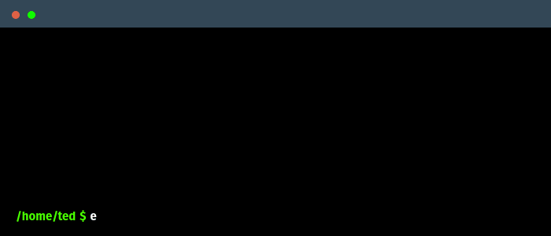
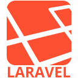

## Hi there 👋

### 
I'm Ted, a devops engineer with over 15 years experience.

- 🌱 I’m currently learning Kubernetes
- ❓ Ask me about anything related to CDN and streaming related technologies
 

## My Skill Set
<table><tr><td valign="top" width="50%">

### Web Technologies 

</td><td valign="top" width="50%">

### DevOps

</td></tr></table>

 

## Connect with me

 

## Github Stats

 
